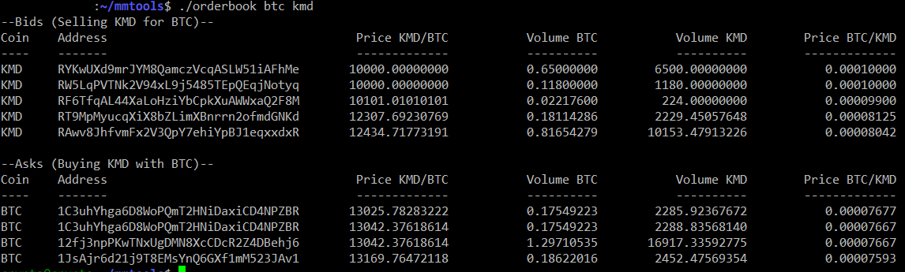

# mmtools
Bash CLI tools for MM2

Scripts in this repo work together as a whole, please follow the setup steps before usage.



## Setup

```
cd ~
git clone https://github.com/webworker01/mmtools.git
cd ~/mmtools
git submodule update --init --recursive

#edit the config file with your wallet passphrase and rpc password
cp config.example config
nano config

#build atomicDEX-API
./init
```

After the build is complete start the marketmaker daemon

```
cd ~/mmtools
./start
```

In another window run:

```
cd ~/mmtools
./electrum RICK
./electrum MORTY
```

Ready to go!

```
./orderbook rick morty
```
